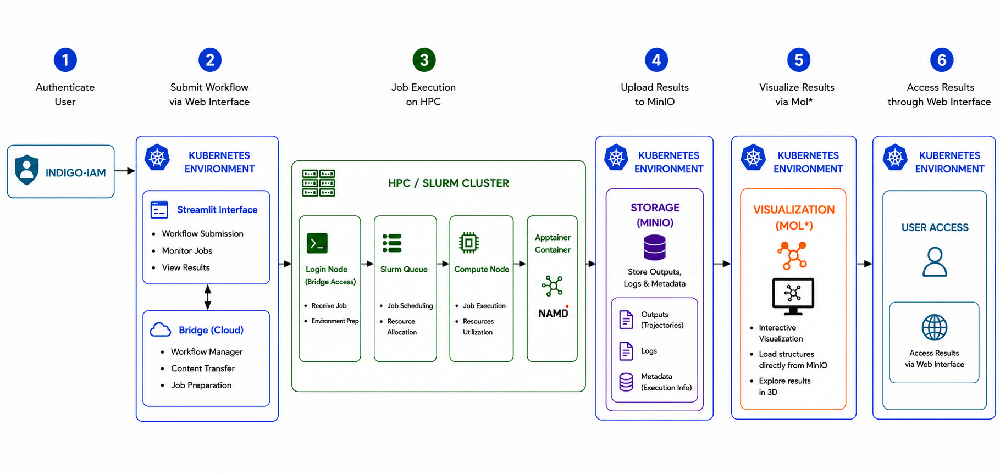
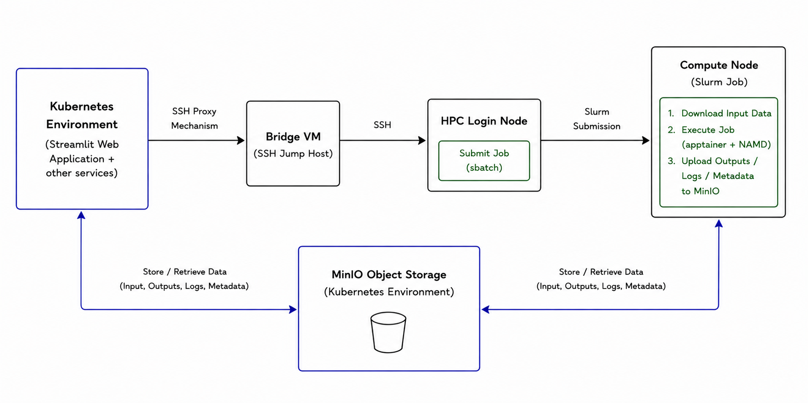
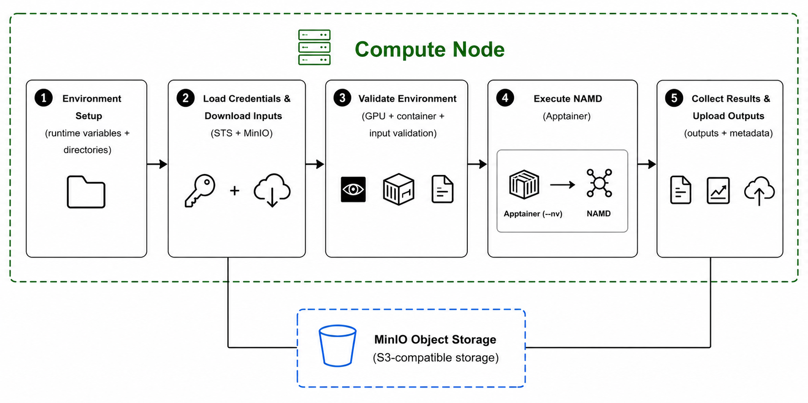
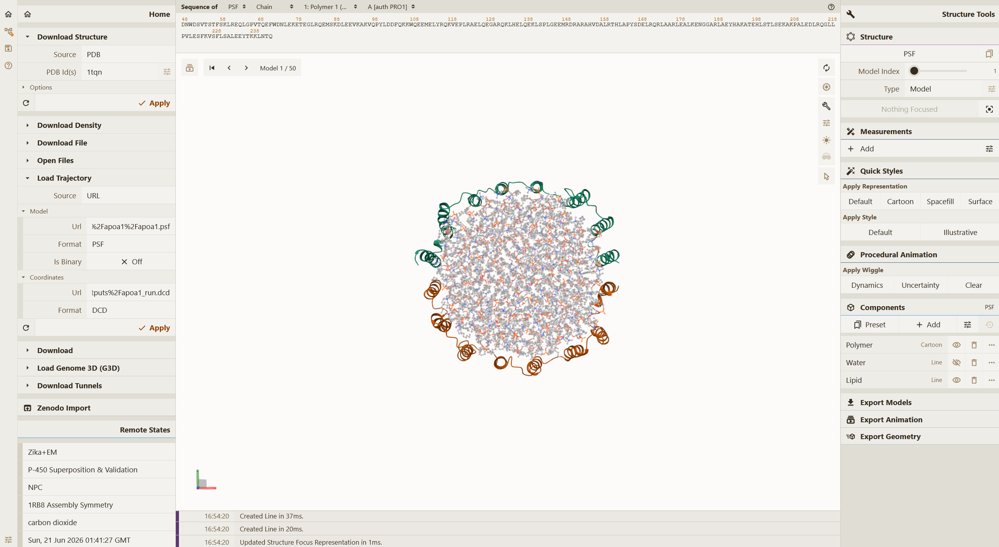

# 2Kluster

**A Cloud-to-HPC Reference Architecture for Scientific Workflows**

2Kluster is a reference architecture for securely offloading computationally intensive scientific workloads from Kubernetes-based cloud environments to remote Slurm-managed HPC resources. It combines cloud-native services for user interaction, authentication, workflow orchestration, data management, and visualization with the computational power of HPC infrastructure.

The architecture integrates OIDC-based identity management, temporary STS credentials, S3-compatible object storage, a Bridge VM for secure SSH-based communication, dynamic Slurm job generation, and Apptainer-based containerized execution into single end-to-end workflow. Users can authenticate, configure and submit workloads, monitor execution, and access results through a web interface without directly interacting with the underlying HPC infrastructure.

The reference architecture was developed and validated as part of an MSc thesis at the University of Bologna, with the experimental work carried out at National Institute for Nuclear Physics (INFN-CNAF). The cloud-native Kubernetes environment and its core services were developed as part of a parallel MSc thesis project, while this work focused on the cloud-to-HPC integration layer, remote Slurm execution, and end-to-end workflow automation. CUDA-enabled NAMD molecular dynamics simulations were used as the validation workload (inside container); the architecture itself is designed to remain independent of a specific scientific application.

## Architecture

2Kluster connects a Kubernetes-based cloud environment with a remote Slurm-managed HPC system while keeping workflow orchestration, data management, and computational parts separated.

  

The workflow is organized around three main layers:

* **Cloud environment** — provides the user-facing Streamlit application, OIDC-based authentication, MinIO object storage, and Mol* visualization. It acts as the workflow orchestration and data-management layer.
* **Bridge layer** — provides the controlled network path between the cloud environment and the HPC infrastructure. Remote HPC operations are performed through SSH using the Bridge VM as a jump host.
* **HPC environment** — uses Slurm for resource allocation and job scheduling. Scientific workloads execute on compute nodes inside Apptainer containers, while input and output data are exchanged directly with MinIO.

Control and data transfers follow separate paths. Job submission and monitoring are performed through the SSH/Bridge path, whereas scientific input files, outputs, logs, and execution metadata are transferred through S3-compatible object storage. This avoids routing large scientific datasets through the SSH control channel.

## End-to-End Workflow

The 2Kluster workflow integrates user authentication, workflow preparation, remote job submission, HPC execution, result collection, and visualization into a single execution pipeline.

1. **User Authentication** — The user first authenticates through the INDIGO-IAM service using an OIDC-based identity management mechanism. After successful authentication, the OIDC token is used to obtain temporary STS credentials for accessing the S3-compatible MinIO object storage system.

2. **Workflow and Input Preparation** — Through the web interface, the user creates a job request by providing the scientific input dataset, application configuration, and requested computational resources. The input files are prepared and uploaded to MinIO, while the workflow parameters are used to prepare the remote HPC execution.

3. **Remote Job Submission** — The workflow information is transferred from the Kubernetes environment to the HPC login node through the Bridge VM using SSH Proxy mechanism. A Slurm job script is dynamically generated from the parameters provided by the user and submitted to the scheduler.

4. **HPC Execution** — Slurm allocates the requested CPU and GPU resources and dispatches the job to a compute node. The compute node retrieves the required input files from MinIO and executes the scientific application inside an Apptainer container.

5. **Result Collection** — After execution, the generated outputs, logs, and execution metadata are collected and uploaded back to MinIO, where they remain available independently of the HPC execution environment.

6. **Result Access and Visualization** — The workflow results are presented to the user through the web application. For molecular dynamics workflows, the generated structure and trajectory files can be accessed from MinIO and interactively visualized through Mol*.

## Implementation

The implementation combines multiple software components for authentication, data transfer, remote job submission, container-based execution, and result visualization. Each component performs a specific task in the workflow and, together, they form the complete end-to-end pipeline.

### Cloud-side Orchestration

A Streamlit-based web application serves as the main interface through which users interact with the system. The interface verifies the user's OIDC account and SSH connection, collects job parameters, input files, and resource requirements, and coordinates the workflow from the Kubernetes environment.

The cloud-side application is packaged as a Docker container and deployed within Kubernetes. The container includes the components responsible for user interaction, OIDC and STS credential processing, MinIO data transfer, SSH-based communication, and dynamic Slurm job scripting. In this way, the cloud environment acts as the entry point for workflow management, data management, and user interaction, while computationally intensive execution is delegated to the HPC environment.

### Remote HPC Submission

The Kubernetes environment and the HPC cluster are deployed on separate network infrastructures and cannot communicate directly with each other. The Bridge VM serves as the communication gateway between these environments. Unlike the other virtual machines hosting the Kubernetes services, the Bridge VM is connected to two different network domains: one network interface provides connectivity to the Kubernetes environment, while the other provides access to the HPC infrastructure. This configuration allows the Bridge VM to communicate with both environments simultaneously.

Cloud-side services do not connect directly to the HPC login node. Instead, all connections are routed through the Bridge VM using SSH Proxy mechanism. This communication model prevents direct exposure of the HPC infrastructure while enabling user parameters, dynamically generated Slurm job scripts, temporary storage credentials, and other workflow-related information to be securely transferred from the cloud environment to the HPC system.

  

After the connection is established, a Slurm job script is dynamically generated according to the parameters selected by the user and submitted from the HPC login node. The job request is then handled by the Slurm scheduler, which allocates the requested resources and dispatches the job to the appropriate compute node for execution.

### Compute-node Execution

After a job is submitted to the Slurm scheduler through the HPC login node, the scientific workflow is executed on the allocated compute node. The compute-node workflow includes environment preparation, loading temporary access credentials, downloading input files from MinIO, executing the scientific application inside an Apptainer container, and uploading the generated results back to MinIO.

  

The temporary STS credentials used during execution originate from the OIDC-based authentication workflow. After successful authentication, the user's OIDC token is exchanged through the MinIO STS service for temporary access credentials. These credentials are transferred from the Kubernetes environment through the HPC login node and loaded on the compute node before accessing MinIO. They are used for both downloading the workflow inputs and uploading the generated outputs, logs, and metadata, without storing permanent object-storage credentials within the workflow.

When the job starts, job-specific temporary directories are created for input files, outputs, logs, and metadata. The required input files are then downloaded from MinIO into the compute-node working directory. Before execution, the workflow verifies the input dataset and application configuration, as well as GPU access and the availability of the Apptainer container image (otherwise the container can be downloaded from MinIO).

The scientific application is subsequently executed inside the Apptainer container using the CPU and GPU resources allocated by Slurm. In the reference architecture, CUDA-enabled NAMD is used as the scientific application for validation the workflow.

Result collection is implemented through an `EXIT`-based mechanism. Outputs, logs, execution metadata, and the application exit code are collected and uploaded back to MinIO even if the scientific application terminates with an error. After the result collection stage is completed, the temporary working directory on the compute node is removed.

### Data Management and Result Retrieval

MinIO provides the shared data exchange layer between the cloud and HPC environments. Scientific input and output files are transferred through S3-compatible object storage rather than through the SSH-based control path used for remote job submission and monitoring. This separation allows workflow control information and potentially large scientific datasets to follow independent communication paths.

For each workflow execution, input files are uploaded to MinIO and associated with a unique `run_id`. During execution, the allocated compute node retrieves the required inputs using the temporary STS credentials generated through the OIDC authentication workflow. The same credentials are subsequently used to upload the generated outputs, logs, and execution metadata back to MinIO.

Results are organized using the workflow `run_id` together with the Slurm job ID, allowing files produced by individual executions to be identified and retrieved independently. After the HPC job has completed, the resulting data remain available through MinIO and can be accessed from the cloud-side application without requiring continued access to the HPC filesystem.

For the NAMD validation workflow, the generated molecular structure and trajectory files can be retrieved from MinIO and loaded into Mol* for interactive visualization automatically.

### Implementation Modules

The cloud-to-HPC workflow is implemented as a set of modular Python components. The orchestration logic was separated into individual modules to improve maintainability, debugging, and reuse of the different workflow functions.

| Module | Role |
| --- | --- |
| [`streamlit_app.py`](hpc-kubernetes/scripts/streamlit_app.py) | Provides the web-based user interface for authentication, workflow configuration, resource selection, execution monitoring, and result visualization. |
| [`run_namd_workflow.py`](hpc-kubernetes/scripts/run_namd_workflow.py) | Main orchestration component. Coordinates authentication, STS credential generation, input preparation, MinIO transfers, remote HPC communication, and workflow submission. |
| [`hpc_client.py`](hpc-kubernetes/scripts/hpc_client.py) | Handles SSH-based communication with the HPC login node through the Bridge VM and manages connection retries and remote script execution. |
| [`slurm_template.py`](hpc-kubernetes/scripts/slurm_template.py) | Dynamically generates the remote execution and Slurm job scripts used for resource allocation, compute-node preparation, Apptainer execution, result collection, and MinIO transfers. |
| [`check_auth.py`](hpc-kubernetes/scripts/check_auth.py) | Validates the OIDC authentication environment and verifies SSH connectivity to the HPC login node through the Bridge VM. |
| [`create_oidc_account.py`](hpc-kubernetes/scripts/create_oidc_account.py) | Implements the OIDC account onboarding workflow, including device authorization and local account configuration. |
| [`config.py`](hpc-kubernetes/scripts/config.py) | Centralizes deployment and runtime configuration used by the orchestration components. |
| [`login_sts.py`](hpc-kubernetes/scripts/login_sts.py) | Defines the interface used for OIDC-to-STS credential generation. The deployment-specific implementation is not included in the public repository. |

## Validation

The proposed architecture was validated using molecular dynamics simulations as a representative scientific workload. NAMD 3.0.2 with CUDA support was selected because it supports parallel CPU- and GPU-based execution and represents a realistic computational workload for HPC systems. The application was executed inside an Apptainer container to provide a portable and reproducible execution environment independent of the underlying HPC software stack.

Two molecular systems of different sizes were used during validation:

- **ApoA1 (Apolipoprotein A-I)** — a relatively small system containing approximately 92,000 atoms, used during the development and initial validation of the workflow.
- **STMV (Satellite Tobacco Mosaic Virus)** — a larger system containing approximately 1.06 million atoms, used to evaluate the workflow with a more computationally and data-intensive workload.

The validation covered the complete workflow rather than only the execution of the scientific application. This included OIDC-based authentication and temporary credential generation, input transfer through MinIO, remote Slurm job submission through the Bridge VM, containerized execution on HPC compute nodes, result collection and storage, and visualization through Mol*.

Both CPU-only and GPU-accelerated execution scenarios were successfully implemented, demonstrating that the architecture can utilize heterogeneous HPC resources. Single-node executions were used as the stable and reproducible basis for the final architecture validation, while multi-node experiments were additionally performed to investigate distributed execution.

The objective of these experiments was not to optimize the computational performance of NAMD itself. Instead, NAMD was used as a representative scientific application to verify that the reference architecture correctly supports the complete scientific workflow under realistic HPC workloads.

  

  <em>Example visualization of ApoA1 workflow outputs retrieved from MinIO and displayed through deployed web-based Mol*.</em>

## MSc Thesis

This repository contains the implementation and experimental work developed for the MSc thesis:

**“Definition and Implementation of a Reference Architecture for Distributed Bioinformatics Workflow: Offloading to HPC Resources from Cloud”**

**MSc in Bioinformatics — University of Bologna, 2026**  
Experimental work carried out at **INFN-CNAF, Bologna, Italy**.

The thesis focused on the cloud-to-HPC integration layer of a broader project developed through two complementary MSc thesis activities. The Kubernetes-based cloud environment and the deployment of its core microservices were developed as part of the parallel thesis work, while this thesis focused on the design and implementation of the reference architecture for offloading scientific workloads from the cloud environment to remote Slurm-managed HPC resources.

